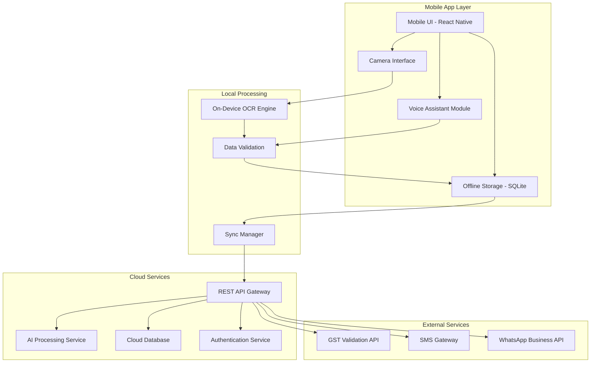
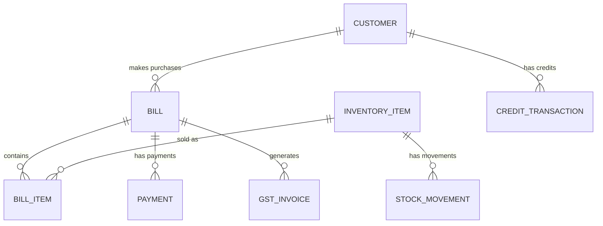

# Design Document: AI-Powered Shopkeeper Billing Digitization

## Overview

The AI-powered shopkeeper billing digitization system is a mobile-first application designed specifically for small shopkeepers in India. The system addresses critical pain points of manual bookkeeping, GST compliance, inventory management, and time-consuming record keeping through intelligent automation and multilingual support.

The architecture follows an offline-first approach to ensure reliability in low-bandwidth environments common in India, with seamless synchronization when connectivity is available. The system integrates advanced OCR technology optimized for Indian languages, voice recognition capabilities, and intelligent business analytics to transform traditional paper-based operations into digital workflows.

## Architecture

### High-Level Architecture



### Offline-First Architecture

The system implements a robust offline-first architecture to handle India's variable connectivity:

- **Local SQLite Database**: Stores all critical data locally with automatic synchronization
- **Queue-Based Sync**: Manages data synchronization with conflict resolution
- **Progressive Enhancement**: Core functionality works offline, enhanced features require connectivity
- **Smart Caching**: Frequently accessed data cached locally to minimize network requests

### Technology Stack

- **Frontend**: React Native for cross-platform mobile development
- **Local Database**: SQLite with Room/Realm for offline storage
- **Backend**: Node.js with Express.js for API services
- **Cloud Database**: PostgreSQL for structured data, MongoDB for document storage
- **AI/ML Services**: TensorFlow Lite for on-device processing, cloud-based models for complex tasks
- **Authentication**: Firebase Auth with biometric support
- **File Storage**: AWS S3 for bill images and documents

## Components and Interfaces

### 1. Mobile Application Layer

#### User Interface Component
- **Responsibility**: Provides intuitive, touch-friendly interface optimized for Indian shopkeepers
- **Key Features**:
  - Multilingual support (Hindi, English, Tamil, Telugu, Bengali, Gujarati, Marathi)
  - High contrast design for outdoor visibility
  - Large touch targets for ease of use
  - Contextual help and onboarding

#### Camera Interface Component
- **Responsibility**: Handles bill photo capture with quality optimization
- **Key Features**:
  - Auto-focus and exposure adjustment
  - Real-time quality feedback
  - Multiple capture modes (single, batch)
  - Image preprocessing for OCR optimization

#### Voice Assistant Component
- **Responsibility**: Processes voice commands in multiple Indian languages
- **Key Features**:
  - Wake word detection ("Hey Shopkeeper" in local languages)
  - Natural language processing for business commands
  - Audio feedback and confirmation
  - Noise cancellation for shop environments

### 2. AI Processing Layer

#### OCR Engine Component
- **Responsibility**: Extracts structured data from bill images
- **Implementation**: Hybrid approach with on-device and cloud processing
- **Key Features**:
  - Multi-language text recognition (Devanagari, Tamil, Telugu scripts)
  - Handwriting recognition for local scripts
  - Table structure detection for itemized bills
  - Confidence scoring for extracted data

```typescript
interface OCRResult {
  customerName?: string;
  items: Array<{
    name: string;
    quantity: number;
    unitPrice: number;
    totalPrice: number;
    confidence: number;
  }>;
  totalAmount: number;
  date?: Date;
  confidence: number;
  requiresReview: boolean;
}
```

#### Voice Processing Component
- **Responsibility**: Converts voice commands to structured actions
- **Implementation**: Integration with Indian language ASR services
- **Key Features**:
  - Multi-language speech recognition
  - Intent classification for business operations
  - Entity extraction (numbers, product names, customer names)
  - Context-aware command processing

### 3. Data Management Layer

#### Local Storage Component
- **Responsibility**: Manages offline data storage and retrieval
- **Schema Design**:

```sql
-- Bills table
CREATE TABLE bills (
    id INTEGER PRIMARY KEY,
    customer_id INTEGER,
    total_amount DECIMAL(10,2),
    bill_date DATE,
    image_path TEXT,
    digitized_data JSON,
    sync_status TEXT DEFAULT 'pending',
    created_at TIMESTAMP DEFAULT CURRENT_TIMESTAMP
);

-- Inventory table
CREATE TABLE inventory (
    id INTEGER PRIMARY KEY,
    item_name TEXT NOT NULL,
    current_stock INTEGER DEFAULT 0,
    unit_price DECIMAL(10,2),
    reorder_level INTEGER DEFAULT 10,
    last_updated TIMESTAMP DEFAULT CURRENT_TIMESTAMP
);

-- Customers table
CREATE TABLE customers (
    id INTEGER PRIMARY KEY,
    name TEXT NOT NULL,
    phone TEXT,
    address TEXT,
    gstin TEXT,
    total_purchases DECIMAL(10,2) DEFAULT 0,
    last_visit DATE
);
```

#### Synchronization Component
- **Responsibility**: Manages data sync between local and cloud storage
- **Key Features**:
  - Conflict resolution strategies
  - Incremental sync to minimize bandwidth
  - Retry mechanisms for failed syncs
  - Data compression for efficient transfer

### 4. Business Logic Layer

#### Inventory Manager Component
- **Responsibility**: Handles stock tracking and management
- **Key Features**:
  - Automatic stock deduction from sales
  - Low stock alerts and reorder suggestions
  - Stock valuation and turnover analysis
  - Batch and expiry date tracking

#### Customer Manager Component
- **Responsibility**: Manages customer relationships and data
- **Key Features**:
  - Customer profile creation and updates
  - Purchase history tracking
  - Credit/debit balance management
  - Customer segmentation and insights

#### GST Invoice Generator Component
- **Responsibility**: Creates GST-compliant invoices
- **Key Features**:
  - B2B and B2C invoice formats
  - Automatic GST calculations
  - Sequential invoice numbering
  - Digital signature and QR code generation

### 5. Analytics and Reporting Layer

#### Analytics Engine Component
- **Responsibility**: Generates business insights and reports
- **Key Features**:
  - Sales trend analysis
  - Product performance metrics
  - Customer behavior insights
  - Profit margin calculations

## Data Models

### Core Data Entities

#### Bill Entity
```typescript
interface Bill {
  id: string;
  customerId?: string;
  items: BillItem[];
  subtotal: number;
  taxAmount: number;
  totalAmount: number;
  billDate: Date;
  imagePath?: string;
  digitizedData: OCRResult;
  invoiceNumber?: string;
  gstDetails?: GSTDetails;
  paymentStatus: 'paid' | 'pending' | 'partial';
  syncStatus: 'synced' | 'pending' | 'failed';
}

interface BillItem {
  id: string;
  name: string;
  quantity: number;
  unitPrice: number;
  totalPrice: number;
  taxRate: number;
  hsnCode?: string;
}
```

#### Customer Entity
```typescript
interface Customer {
  id: string;
  name: string;
  phoneNumber?: string;
  address?: string;
  gstin?: string;
  customerType: 'regular' | 'wholesale' | 'retail';
  creditLimit: number;
  currentBalance: number;
  totalPurchases: number;
  lastVisit: Date;
  preferredLanguage: string;
  loyaltyPoints: number;
}
```

#### Inventory Item Entity
```typescript
interface InventoryItem {
  id: string;
  name: string;
  category: string;
  currentStock: number;
  unitPrice: number;
  costPrice: number;
  reorderLevel: number;
  maxStock: number;
  unit: string; // 'piece', 'kg', 'liter', etc.
  hsnCode?: string;
  taxRate: number;
  supplier?: string;
  expiryDate?: Date;
  batchNumber?: string;
}
```

#### Voice Command Entity
```typescript
interface VoiceCommand {
  id: string;
  audioData: Blob;
  transcription: string;
  intent: 'add_item' | 'check_stock' | 'find_customer' | 'generate_bill';
  entities: Record<string, any>;
  confidence: number;
  language: string;
  timestamp: Date;
}
```

### Data Relationships



## Correctness Properties

*A property is a characteristic or behavior that should hold true across all valid executions of a system—essentially, a formal statement about what the system should do. Properties serve as the bridge between human-readable specifications and machine-verifiable correctness guarantees.*

Now I need to analyze the acceptance criteria to determine which ones can be tested as properties. Let me use the prework tool:
